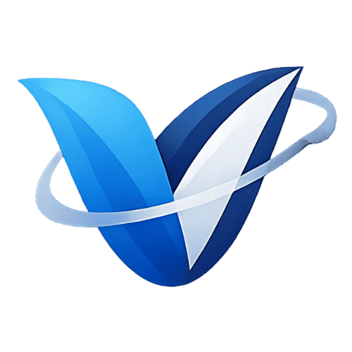
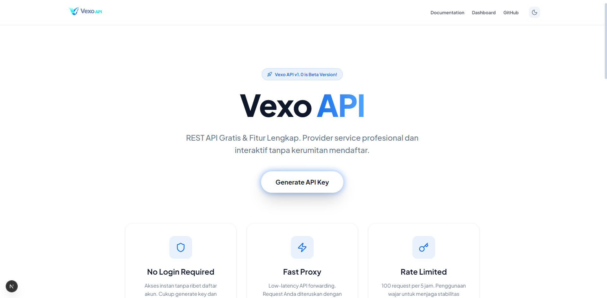

<div align="center">




# 🚀 Vexo API

**Serverless API Gateway & Secret Management**

<p align="center">
  <a href="https://vexoapi.azzamcodex.site/" target="_blank">
    
  </a>
</p>

<p align="center">
  <a href="https://github.com/AzzamCyber/VexoAPI/stargazers"></a>
  <a href="https://github.com/AzzamCyber/VexoAPI/network/members"></a>
  <a href="https://github.com/AzzamCyber/VexoAPI/pulls"></a>
  <a href="https://github.com/AzzamCyber/VexoAPI/issues"></a>
  <a href="https://github.com/AzzamCyber/VexoAPI/blob/master/LICENSE"></a>
</p>

<p align="center">
  
  
  
</p>

<p align="center">
  <a href="https://nextjs.org/"></a>
  <a href="https://tailwindcss.com/"></a>
  <a href="https://upstash.com/"></a>
  <a href="https://greensock.com/"></a>
</p>

<a href="https://github.com/AzzamCyber/VexoAPI">
  
</a>

*Dibangun untuk kecepatan, skalabilitas, dan efisiensi developer. Tidak ada backend setup, tidak ada registrasi.*

---

</div>

<br/>

## 🌌 Preview

<p align="center">
  
</p>

<br/>

## ✨ Fitur Unggulan

Vexo API dibangun dengan arsitektur modern yang mengedepankan keamanan dan kecepatan akses. Berikut adalah fitur utamanya:

<table>
  <tr>
    <td width="50%" align="center">
      
      <h3>🛡️ No Login Required</h3>
      <p>Akses instan tanpa ribet mendaftar akun. Pengguna cukup melakukan klik <em>Generate Key</em> dan langsung bisa menggunakan API.</p>
    </td>
    <td width="50%" align="center">
      
      <h3>⚡ Fast Proxy Engine</h3>
      <p>Low-latency API forwarding. Request diteruskan secara instan menggunakan infrastruktur Edge Vercel tanpa bottleneck.</p>
    </td>
  </tr>
  <tr>
    <td width="50%" align="center">
      
      <h3>⏳ Intelligent Rate Limiter</h3>
      <p><b>Free Tier:</b> 100 request/5 jam per API Key.<br/><b>VIP Tier:</b> Custom limits (ex: 10,000/jam) atau akses <b>Unlimited</b>.</p>
    </td>
    <td width="50%" align="center">
      
      <h3>🔐 IP Fingerprinting</h3>
      <p>Melacak penggunaan API berdasarkan Alamat IP. Maksimal 2 API Key aktif per IP untuk mencegah <em>spam</em>. Terdapat fitur blokir permanen.</p>
    </td>
  </tr>
</table>

### 🎩 Premium Admin Dashboard
Manajemen sistem lengkap dengan fitur:
- 🔐 **Multi-Auth Login** (Username/Password & 6-Digit PIN).
- 📡 **Monitoring IP Registry** (Active & Blocked).
- 🔑 **Manajemen API Key** (Revoke, Reset Usage, Custom VIP Generation).
- 📊 **Statistik real-time** penggunaan database.

<br/>

## 🧠 Core Logic & Architecture

<p align="center">
  
</p>

Vexo API beroperasi dengan alur logika yang sangat efisien menggunakan **Upstash Redis** sebagai *Single Source of Truth* (SSOT):

1. **Key Generation Logic**: 
   Saat pengguna menekan tombol generate, sistem mencatat `IP Address` mereka ke dalam Redis. Jika IP tersebut belum memiliki lebih dari 2 kunci aktif, sistem akan men-generate `nanoid` sepanjang 16 karakter dan menyimpannya bersama data `limit`, `used`, dan `resetTime`.
2. **Middleware & Proxy**:
   Setiap request ke endpoint dinamis `/api/[...slug]` wajib menyertakan parameter `?key=YOUR_KEY`. Sistem akan memvalidasi kunci tersebut secara real-time ke Redis. Jika valid, request diteruskan (Proxy) ke target *endpoint* asli dan headers spesifik `X-RateLimit-*` akan dilampirkan.
3. **VIP Logic**:
   Sistem membaca flag `limit: -1` sebagai kunci VIP (Unlimited). Hitungan *usage* tetap dicatat demi keperluan analitik Admin, namun API tidak akan pernah diblokir karena *Rate Limiter* dilumpuhkan khusus untuk kunci ini.

<p align="center">
  
</p>

<br/>

## 📖 Quick Start (API Consumer)

Gunakan Vexo API sebagai gateway untuk request Anda dengan langkah mudah berikut:

### 1. Dapatkan API Key
Kunjungi [vexoapi.azzamcodex.site](https://vexoapi.azzamcodex.site/) dan klik **Generate Key**.

### 2. Lakukan Request
Tambahkan parameter `key` pada setiap request Anda ke endpoint Vexo.

**Contoh menggunakan cURL:**
```bash
curl "https://vexoapi.azzamcodex.site/api/your-endpoint?key=YOUR_API_KEY"
```

**Contoh menggunakan Fetch API:**
```javascript
fetch("https://vexoapi.azzamcodex.site/api/data?key=YOUR_API_KEY")
  .then(res => res.json())
  .then(data => console.log(data));
```

<br/>## 💻 Tech Stack

Proyek ini dibangun menggunakan kombinasi teknologi modern terbaik:

<p align="center">
  <a href="https://skillicons.dev">
    
  </a>
</p>

<br/>

<br/>

## 🤝 Contributing & Support

Kontribusi selalu diterima! Lihat file [CONTRIBUTING.md](CONTRIBUTING.md) untuk panduan berkontribusi. 
- 🗺️ Lihat rencana masa depan kami di [ROADMAP.md](ROADMAP.md).
- 🆘 Butuh bantuan? Cek [SUPPORT.md](SUPPORT.md).
- ⚠️ Baca [DISCLAIMER.md](DISCLAIMER.md) untuk informasi penggunaan.

Jangan lupa untuk mengecek [CHANGELOG.md](CHANGELOG.md) untuk pembaruan terbaru dan [SECURITY.md](SECURITY.md) untuk kebijakan keamanan.

<br/>

## ⚡ Powered By

Vexo API berjalan di atas infrastruktur terbaik dunia:

<p align="center">
  
  
  
  
</p>

<br/>

## 💖 Support the Project

Jika proyek ini membantu Anda, pertimbangkan untuk memberikan dukungan:
- ⭐ Berikan **Star** pada repositori ini.
- 🚀 Bagikan proyek ini kepada teman-teman developer Anda.
- 💬 Berikan masukan atau saran melalui [Issues](https://github.com/AzzamCyber/VexoAPI/issues).

<br/>

## 👨‍💻 Credits

**Designed & Developed by [Azzam Codex](https://github.com/AzzamCyber)**

<p align="center">
  <a href="https://github.com/AzzamCyber">
    
  </a>
</p>

> *"Building the future, one line of code at a time."*

Hak Cipta &copy; 2026 PT Azzam Codex. Dilindungi Undang-Undang.

---

<div align="center">
  
  <br/>
  
</div>
